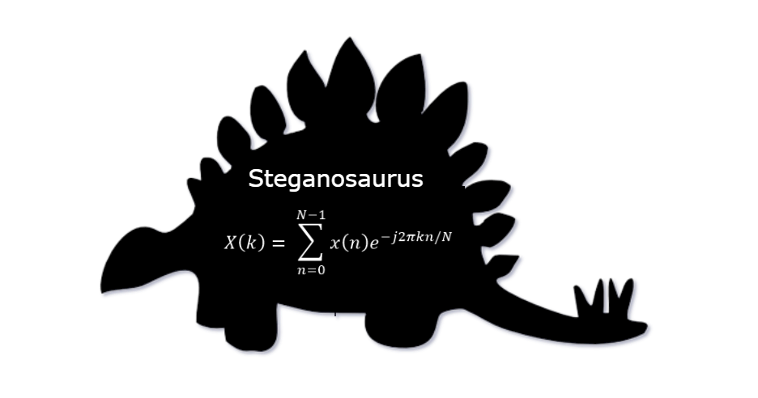
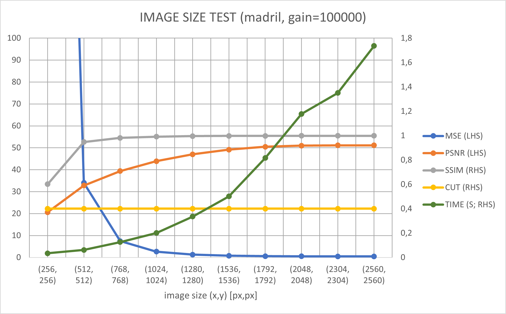
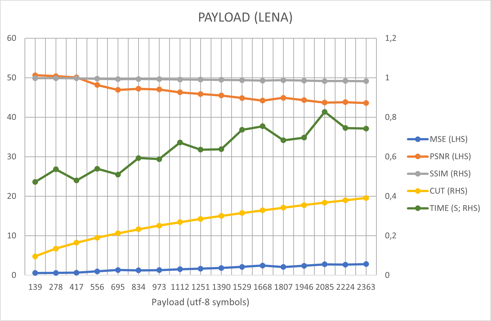
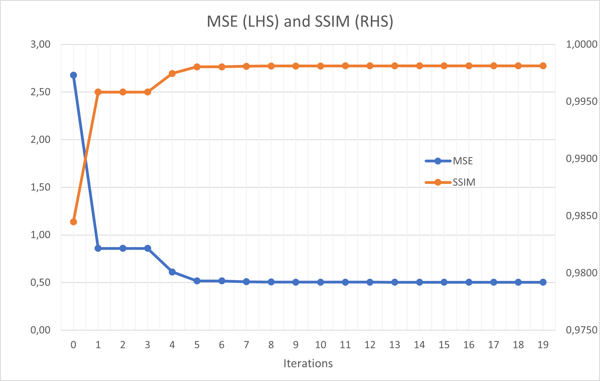
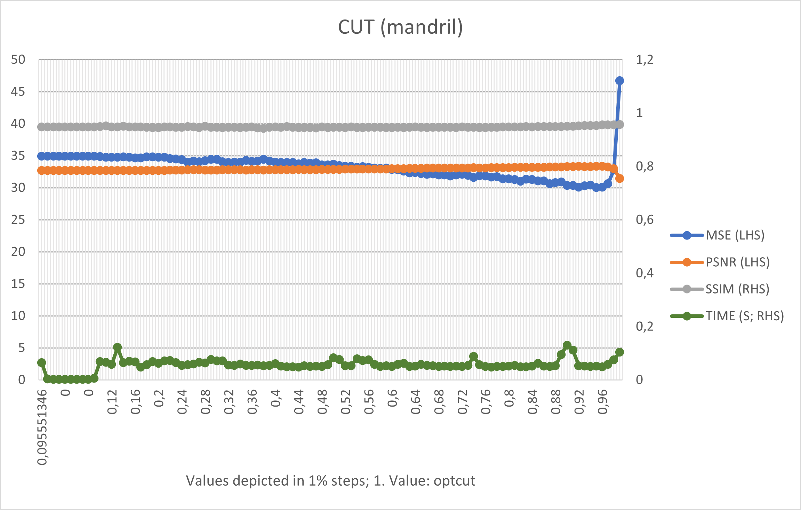

<div id="top"></div>
<!-- The https://github.com/othneildrew/Best-README-Template was used as reference for this Readme -->

<!-- PROJECT SHIELDS -->
[![Contributors][contributors-shield]][contributors-url]
[![Forks][forks-shield]][forks-url]
[![Stargazers][stars-shield]][stars-url]
[![Issues][issues-shield]][issues-url]
[![GNU License][license-shield]][license-url]


<!-- PROJECT LOGO -->
<br />
<div align="center">
  <a href="https://github.com/PIX3LFLUX/Steganosaurus">
    
  </a>

<h3 align="center">Steganosaurus</h3>

  <p align="center">
    Fourier-Transform Image Steganography App
    <br />
    <a href="https://github.com/PIX3LFLUX/Steganosaurus"><strong>Explore the docs »</strong></a>
    <br />
    <br />
    <a href="https://github.com/PIX3LFLUX/Steganosaurus">View Demo</a>
    ·
    <a href="https://github.com/PIX3LFLUX/Steganosaurus/issues">Report Bug</a>
    ·
    <a href="https://github.com/PIX3LFLUX/Steganosaurus/issues">Request Feature</a>
  </p>
</div>

# **Steganosaurus**
Hide messages inside the Fourier transform of an image and decode them!
(How would they know?)

<br>


# Disclaimer
This is a project from the University of applied sciences in Karlsruhe, licensed under the [GNU license](#license).
The code written is not by any means what you would consider *professional*. We are both students learning the path of programming and have tried our best at keeping the code organized and readable. If there are any improvements to be made, please let us know.

<br>

# Table of Contents

- [**Steganosaurus**](#steganosaurus)
- [Disclaimer](#disclaimer)
- [Table of Contents](#table-of-contents)
- [Introduction](#introduction)
  - [Goal](#goal)
  - [What is the (fast) Fourier transform?](#what-is-the-fast-fourier-transform)
  - [Our approach](#our-approach)
  - [What makes the digital approach so great?](#what-makes-the-digital-approach-so-great)
  - [Problems](#problems)
- [Getting Started](#getting-started)
  - [Prerequisites](#prerequisites)
  - [Usage](#usage)
- [Backend: How it all works](#backend-how-it-all-works)
  - [1. Encoding](#1-encoding)
  - [2. Decoding](#2-decoding)
  - [What we improved](#what-we-improved)
  - [Tests](#tests)
    - [measurements](#measurements)
    - [resize](#resize)
    - [payload](#payload)
    - [gain optimization](#gain-optimization)
    - [cut](#cut)
- [Frontend: What you see](#frontend-what-you-see)
- [Settings](#settings)
  - [Default values](#default-values)
- [Header](#header)
- [Possible improvements](#possible-improvements)
- [Contributing](#contributing)
- [License](#license)
- [Contact](#contact)


<br>
<br>

# Introduction

## Goal  
The goal of this project is to send text messages hidden inside images using the Discrete Fourier Transform (or rather FFT).
For ease of use and general usability, we decided to pack this program into a python GUI-app, based on the [kivy](https://kivy.org/#home) framework. You can download the latest .apk from [here][release-url].

<p align="right">(<a href="#top">back to top</a>)</p>

## What is the (fast) Fourier transform?
The discrete Fourier transform (short: DFT) converts the image from the spatial domain to the frequency domain. It is discrete, because the input (in this case pixels) is quantized and limited. The frequency domain easily reveals frequential properties of the image, which is often used in image file compression. You can imagine the frequency domain with the DFT as another way of depicting the image, with the DFT as its function.  
However, you need to keep in mind that the resulting image is ***complex*** in the frequency domain, which means that after calculating the absolute and angle, you are left with **two planes**. The angle plane, also called the *phase*, has information about the relative location of the frequencies, whereas the absolute plane has information about their magnitude, also called *magnitude spectrum*.  When hiding information inside these planes, it is recommended to use the magnitude spectrum, since we mostly want to keep the image and its original proportions intact. Which is why we only used the magnitude spectrum.
The DFT as an algorithm can be broken down into smaller DFTs and their counterparts, which makes the then so called fast Fourier transform (FFT) an n*O(log(n)) algorithm, which is much faster.


<p align="right">(<a href="#top">back to top</a>)</p>


## Our approach
When it comes down to Image Steganography, most resources you will find on the internet focus on hiding the image 'as is' in another image (like [here](https://www.researchgate.net/profile/Tamer-Rabie/publication/269705199/figure/fig2/AS:413450326036484@1475585647428/a-A-typical-chrominance-a-magnitude-spectrum-of-the-original-carrier-image-before.png)).
Although this looks promising, it has several drawbacks:
* Because the image to be hidden is not compressed in any way, the effect on the carrier image is also quite large.
* Payload in the form of text is rather limited, since it requires a pretty high resolution of the hidden image for the letters to be recognizable.
Therefore we used a digital approach, where we would embed the information in a binary manner into the Fourier transform.

<p align="right">(<a href="#top">back to top</a>)</p>

## What makes the digital approach so great?
The benefit over 'conventional' LSB embedding is that the hidden information is much harder for the human eye to see and arguably for computer programs as well, since it was hidden in the frequency domain, which corresponds to subtle changes of color in high frequency parts of the stego image. It is also spread across the whole image, which makes it even harder to detect with the naked eye. Compared to the 'analog' approach, the payload can be much higher without any noticeable disturbance of the carrier image. Theoretically, it also allows for **any digital file** to be "hidable" inside the image.

<p align="right">(<a href="#top">back to top</a>)</p>

## Problems
But this also comes at a cost:
* The payload cannot be as large as that of simple LSB embedding in the spatial domain, since one image plane corresponds to only **one absolute frequency plane**.
* Furthermore, no two images are the same, which changes the equivalent in the frequency domain and can make it harder to embed and later decode information.
* To top it off, storing text or rather any information in a binary manner relies heavily on the 'distinguishability', or *distance between two binary values*. If even one bit is falsly recognized, the whole letter becomes corrupt, and maybe the message can not be read anymore. So it is crucial to embed the hidden message with as much 'weight' (also referred to as 'gain') as possible, since this also correlates with consistency. (A possible [solution](#possible-improvements) to this)

<p align="right">(<a href="#top">back to top</a>)</p>
<br>
<br>

<!-- GETTING STARTED -->
# Getting Started

To *use* this app, you can just head over the [releases][release-url] page and download the latest .apk to your Android device. Make sure **install third-party apps** is enabled. If not, you will find this option under developer options.  
To *modify and test* you should install the environment mentioned in [prerequisites](#prerequisites) and [usage](#usage).

## Prerequisites

To *modify* you need to install the conda environment by typing:
  ```sh
  conda env create -f requirements.yml
  ```
The environment name will be *stego-env*.

<p align="right">(<a href="#top">back to top</a>)</p>


<!-- USAGE EXAMPLES -->
## Usage

After installation of the conda environment open `FFT_stego.ipynb` in your favorite jupyter notebook editor and select `stego-env` as kernel.
For testing use `FFT_stego_test.ipynb`.

<p align="right">(<a href="#top">back to top</a>)</p>


# Backend: How it all works

The process is divided into two major parts:  
* **Encoding**: process of embedding binary information into the Fourier-plane
* **Decoding**: process of reading binary information from the Fourier-plane

<p align="right">(<a href="#top">back to top</a>)</p>
<br>

## 1. Encoding

---

***1. Set/Get the settings***  
Setting and/or getting the settings is performed via `set_settings()` and `load_settings()`. Optionally, the settings can be reset to their default values via `reset_settings()`.  
<br>

***2. Load the cover image and split its channels***  
Splitting the image depends on the color space set, which can be simple `RGB` or `YCbCr`.  

> **RGB**  
>  
> **YCbCr**  
>   
<br>

***3. Create header***  
For better reference see [`Header`](#header)  
<br>

***4. Convert message to binary***  
The message to be hidden is converted from utf-8 to its binary representation. Then, a gain is applied to all `1`'s, so it can later be distinguished from the other coefficients.  
<br>

***5. Apply or calculate the mask***  
If the `optcut=True` option is enabled, an optimum for the mask size is calculated and returned.
The returned value **has to be sent to the receiver**, or he can not know at which location/pixel the embedding took place.  
<br>

> **Red channel with default cut: 0.4**  
>   

<br>

***6. Embed into masked FFT***  
The now binary message simply replaces the current values of the FFT, in range of the mask. Embedding is only used on the top half, since after the inverse Fourier transform the top half will be mirrored to the bottom half either way.    
> **FFT of red channel with default cut**  
> 
  
<br>

***7. Reverse the FFT and stitch the split image back together***  
Calculating the inverse Fourier transform means mirroring the upper part of the FFT to the lower part, by which also the previously applied gain is halved.  
> **Absolute FFT of green channel with default cut and gain of 10000**  
>   
> **FFT of green channel with default cut and gain of 10000 as height plot**  
>   

<br>


<br>

***8. Store***  
> **Stego image (left) and original image (right)**  
> 
> 

> **Channel histograms RGB. Channels stacked vertically.**  
> 
> **Channel histograms YCbCr. Channels stacked vertically.**  
> 
> Notice how a narrower histogram and using less channels increases the absolute difference between the unmodified cover image and the modified stego image.

<p align="right">(<a href="#top">back to top</a>)</p>
<br>
<br>

## 2. Decoding

---

***1. Set/Get the settings***  
Analog to [`Encoding`](#encoding)  

<br>

***2. Load stego image and split into its channels***  
<br>

***2.5 Get cut value***  
Either as input or if none is provided, uses the [default](#default-values).  
<br>

***3. Calculate mask***  
The mask is calculated from the cut value.  
<br>

***4. Buffer analog values from masked FFT***  
These values typically range between half of the gain at which the message was embedded and 0.  
> **Absolute FFt of red channel, zoomed in**  
> 
<br>

***5. Convert analog message to binary***  
To convert the analog message to binary a simple threshold is used. An bimodal histogram is to be expected (since we want to decode in binary). The threshold is calculated by dividing the maximum analog value by 2. Experience shows that this works quite well and is especially very fast and therefore useful for optimizing the gain. As stated [here](#problems), distinguishability depends greatly on the image itself and in this case the `YCbCr` colorspaces chromina channels have a much more narrow distribution, which results in a greater distance between `1`s and `0`s of the analog message.
> **Histogram of analog message, RGB, gain=10000**  
>   
> **Histogram of analog message, YCbCr, gain=10000**  
>   
<br>

***6. Decode header and throw away leftover values***  
For better reference see [`Header`](#header).  
<br>

***7. Parse message***  
Since the content is spread over two or three channels, it has to be merged before the decoding process to utf-8 can take place. If the gain is to be optimized, the parsed submessages are compared to those of the encoding step and an optimal gain for each channel is found (see [here](#what-we-improved)).    
<br>

***8. Decode hidden message***  
Decode binary message to utf-8. Also works with Emojis.

<p align="right">(<a href="#top">back to top</a>)</p>
<br>
<br>

## What we improved

---

To reduce the effect of the hidden message to the cover image, we improved upon a few aspects:  
<br>

* *Decreased mask size* by calculating only the necessary mask from the binary message (`optcut=True`).
> **Red channel absolute FFT masked with `optcut=False`**  
>   
> **Cr channel absolute FFT masked with `optcut=True`**  
> 

<br>

* Introduced another color space: *YCbCr*. Message is only stored in the two chromina channels. The `YCbCr` color space allows for a separation of the lumina channel, which contributes greatly to the humans ability of noticing changes/differences. The two chromina channels however contribute much less to the local contrast of the image and are therefore used as carriers for our hidden message.  
> **Absolute FFT of all 3 channels of stego image in YCbCr color space**  
> 

<br>

* Introduced *gain optimization*. With `recursive_count` the level of optimization can be adjusted.
* Before the gain can be optimized, a gain has to be found at which the decoding process succeeds. This is achieved by the `gain_booster()` function, which doubles the previous gain each time the decoding process fails.
* Calculate gain for each channel *individually*.
> **Gain optimization from 10000 to around 3000. `recursive_count` was set over 14. RGB color space (3 channels)**  
>   
>   
> **Absolute FFT red channel with `gain=10000`**  
>   
> **Absolute FFT red channel with `gain=2500`**  
>   
> More reference on [gain optimization](#gain-optimization).  

It is worth noting, that the benefit of gain optimization not only depends on the iterations, but also on the cover image itself.
Prior tests have also shown that more than 5 iterations is often unnecessary and a reasonable improvement can already be achieved at 3 iterations.

<p align="right">(<a href="#top">back to top</a>)</p>
<br>
<br>

## Tests

<br>

To confirm our improvements were working, we conducted some simple tests:

| test              |             description              |                                                            expectation                                                            |
| :---------------- | :----------------------------------: | :-------------------------------------------------------------------------------------------------------------------------------: |
| resize            | Changing the size of the cover image |                           A bigger cover image size should decrease the impact of the constant payload                            |
| payload           |          Increasing payload          |                       A bigger payload means more info to store, which means more impact on the cover image                       |
| gain optimization |       Reducing/Improving gain        |                                        A better gain means less impact on the cover image                                         |
| cut               |         Increasing mask size         | Since we are embedding from the top left corner, the message will be embedded closer to the lower frequencies if cut is increased |

To measure the differences between the cover and stego image, we choose two "generic" approaches and a more sophisticated one, PSNR & MSE being the simple ones, and SSIM the more complicated.

<p align="right">(<a href="#top">back to top</a>)</p>
<br>

### measurements

| acronym | full name                          | description                                                                                                 | formula | range(worst -> best) |
| :------ | :--------------------------------- | :---------------------------------------------------------------------------------------------------------- | :------ | :---- |
| MSE     | Mean Square Error                  | Sum of squared differences per pixel                                                                        ||    inf -> 0     |
| PSNR    | Peak Signal to Noise Ratio         | A logarithmic way of displaying MSE                                                                         |  |   0 -> inf    |
| SSIM    | Structure Similarity Index Measure | Takes a relative approach by using the statistical properties of the images. Better resembles human vision. ||    0 -> 1     |

<p align="right">(<a href="#top">back to top</a>)</p>

### resize


<!--  -->
<figure>

<figcaption>Image size test on <i>mandril_color.tif</i> .Constant gain, constant cut.</figcaption>
</figure>
The test shows a steep decrease in MSE and increase in SSIM as the cover image size goes up. The results show an exponential correlation between image size and time to process. The results are as expected.

<p align="right">(<a href="#top">back to top</a>)</p>
<br>
<br>

### payload

<!--  -->
<figure>

<figcaption>Payload test on <i>lena_color_512.tif</i>. Optimized gain, optimized cut.</figcaption>
</figure>
As the payload increases, the mask size also increases. Therefore the time to process will be higher. And more information is stored, the stronger is the impact on the cover image, which can be derived from the sinking SSIM and PSNR. Results are as expected.

<p align="right">(<a href="#top">back to top</a>)</p>
<br>
<br>

### gain optimization

<!--  -->
<figure>

<figcaption>Gain optimization test on <i>lena_color_256.tif</i>. Constant payload, constant cut.</figcaption>
</figure>
When optimizing the gain, the first iterations contribute the most to cover image integrity. After the 5. iteration, the improvements are negligable as the SSIM and MSE converge.

<p align="right">(<a href="#top">back to top</a>)</p>
<br>
<br>

### cut

<!--  -->
<figure>

<figcaption>Cut test on <i>mandril_color.tif</i>. Constant payload, constant gain.</figcaption>
</figure>
This test did not work as expected. By increasing the cut and therefore the mask size, more information is embedded into the lower frequencies, which contribute more to the image as their amplitude is not only higher, but they are also much more noticeable to the human eye. (This trait is often used in image compression). Nevertheless, the test showed positive results towards increase in mask size, but rapidly changes momentum as full image size is reached. This test perfectly shows the difference between the capabilities of some measurement instruments in image processing and how important it is to include multiple measurement approaches (like SSIM, although it also did not perform so well). Even though SSIM is supposed to mimic how humans perceive images, it still failed at evaluating the more noticeable difference in lower frequencies.

<p align="right">(<a href="#top">back to top</a>)</p>
<br>
<br>
<br>

# Frontend: What you see

<p align="right">(<a href="#top">back to top</a>)</p>
<br>
<br>
<br>


# Settings
Almost all settings are stored inside `settings.ini`

<br>

| Variable name   | Type  | Description                                                                      |
| --------------- | ----- | -------------------------------------------------------------------------------- |
| optcut          | bool  | calculate optimal cut                                                            |
| colorspace      | int   | select which color space to use                                                  |
| max_cut         | float | percentage of the image which can/should be used for de- & encoding.             |
| max_row         | int   | resize threshold in px for y-axis                                                |
| max_col         | int   | resize threshold in px for x-axis                                                |
| resize_enable   | bool  | enable resize                                                                    |
| image_type      | int   | image format for encoding                                                        |
| recursive_count | int   | specify iterations through `gain_optimizer` (higher -> better, but takes longer) |
| static_gain     | int   | choose specific *global* gain. Ignores gain optimization. Disabled if 0.         |

<p align="right">(<a href="#top">back to top</a>)</p>
<br>


## Default values

---

| Variable name   | Value |
| --------------- | ----- |
| optcut          | True  |
| colorspace      | 0     |
| max_cut         | 0.4   |
| max_row         | 900   |
| max_col         | 1600  |
| resize_enable   | True  |
| image_type      | 0     |
| recursive_count | 0     |
| static_gain     | 0     |

<p align="right">(<a href="#top">back to top</a>)</p>
<br>
<br>

# Header

For the decoding process further information is required, like *length of message*.
To reduce the effort for the receiving user and to ensure a clean result, this additional information is stored inside a header,
which is **only prepended to the last channel**.

The header looks like this:

| content   | MESSAGE_TYPE | COLORSPACE | MESSAGE_LENGTH_0 | MESSAGE_LENGTH_1 | MESSAGE_LENGTH_2 |
| :-------- | :----------: | :--------: | :--------------: | :--------------: | :--------------: |
| bits used |      2       |     1      |        32        |        32        |        32        |


(Currently the `COLORSPACE` and `MESSAGE_TYPE` is unused, but could be useful in the future.)


* **theoretical max**:  
3 * 2^32-1 bit = 12 884 901 885 bit	= 1 610 612 735.625 bytes = **1.6 GiBi** (!!!)

* **typical (FHD image)**:  
1920 * 1080 * 3	bits = 2 073 600 * 3 bits = 6 220 800 bits  
6 220 800 * 40% bits = 2 488 320 bits = 311 040 bytes = **311.04 KiBi**
* **iphone 13**:  
3024 * 4032 * 3 bits = 12 192 768 * 3 bits	= 36 578 304 bits  
36 578 304 * 40% bits = 14 631 321.6 bits = 1 828 915.2 bytes = **1 828.9 KiBi**

<p align="right">(<a href="#top">back to top</a>)</p>
<br>
<br>
<br>

# Possible improvements
Since information is stored in binary, one could apply several solutions from the digital world, such as:
1. Different coding (e.g. Gray code, Manchester code, ...)
2. Error-detection and/or correction (hamming code, redundancy, ...), especially useful with the image compression from WhatsApp, Instagram, Telegram, ...
3. Support for 4 or more channel image formats (.png with alpha channel)
4. Support for animated graphics (.apng, .gif, ..)
5. Support for video (.mp4, .mkv, ...)
6. Encryption
7. Optimizing gain even further with local threshold filters instead of global channel threshold (e.g. in the shape of a 3x3 square)
8. Different masks (circle, diamond, ...)
9. Different decode starting order (top right, bottom left,...)
10. Support for embedding any type of digital file (.pdf, .zip, .exe, .mp3, ...)
11. Get rid of the exchange of the `cut` value by storing it symmetrically in the middle of the FFT (constant location).
12. Use the `np.rfft()`, which is only half of the FT, since half of it is redundant. Saves time.
 
<p align="right">(<a href="#top">back to top</a>)</p>

<br>
<br>

<!-- CONTRIBUTING -->
# Contributing

Contributions are what make the open source community such an amazing place to learn, inspire, and create. Any contributions you make are **greatly appreciated**.

If you have a suggestion that would make this better, please fork the repo and create a pull request. You can also simply open an issue with the tag "enhancement".
Don't forget to give the project a star! Thanks again!

1. Fork the Project
2. Create your Feature Branch (`git checkout -b feature/AmazingFeature`)
3. Commit your Changes (`git commit -m 'Add some AmazingFeature'`)
4. Push to the Branch (`git push origin feature/AmazingFeature`)
5. Open a Pull Request

<p align="right">(<a href="#top">back to top</a>)</p>

<br>
<br>

<!-- LICENSE -->
# License

Distributed under the GNU License. See [LICENSE][license-url] for more information.

<p align="right">(<a href="#top">back to top</a>)</p>


<br>
<br>

<!-- CONTACT -->
# Contact

Maximilian Ketschik -  kema1039@h-ka.de  
Deniz Braun    -  brde1020@h-ka.de

Project Link: [https://github.com/PIX3LFLUX/Steganosaurus](https://github.com/PIX3LFLUX/Steganosaurus)

<p align="right">(<a href="#top">back to top</a>)</p>

<!-- MARKDOWN LINKS & IMAGES -->
<!-- https://www.markdownguide.org/basic-syntax/#reference-style-links -->
[contributors-shield]: https://img.shields.io/github/contributors/PIX3LFLUX/Steganosaurus.svg?style=for-the-badge
[contributors-url]: https://github.com/PIX3LFLUX/Steganosaurus/graphs/contributors
[forks-shield]: https://img.shields.io/github/forks/PIX3LFLUX/Steganosaurus.svg?style=for-the-badge
[forks-url]: https://github.com/PIX3LFLUX/Steganosaurus/network/members
[stars-shield]: https://img.shields.io/github/stars/PIX3LFLUX/Steganosaurus.svg?style=for-the-badge
[stars-url]: https://github.com/PIX3LFLUX/Steganosaurus/stargazers
[issues-shield]: https://img.shields.io/github/issues/PIX3LFLUX/Steganosaurus.svg?style=for-the-badge
[issues-url]: https://github.com/PIX3LFLUX/Steganosaurus/issues
[license-shield]: https://img.shields.io/github/license/PIX3LFLUX/Steganosaurus.svg?style=for-the-badge
[license-url]: https://github.com/PIX3LFLUX/Steganosaurus/blob/master/LICENSE
[product-screenshot]: images/screenshot.png
[release-url]: https://github.com/PIX3LFLUX/Steganosaurus/release